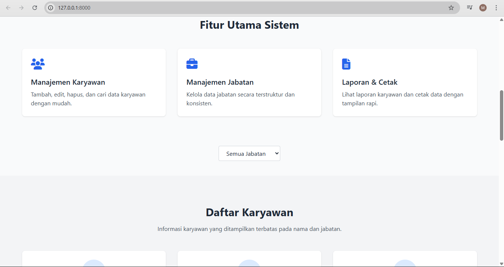
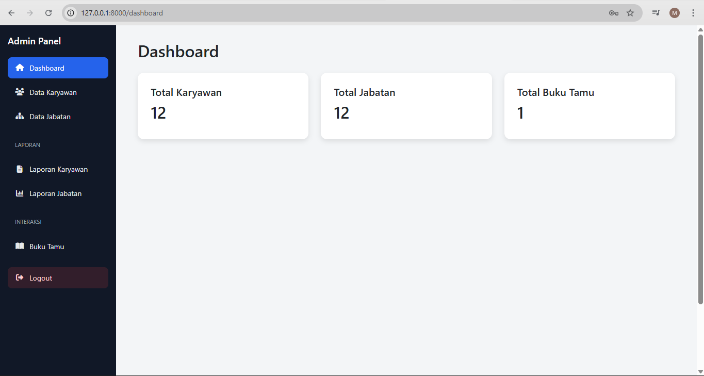

# Sistem Manajemen Data Karyawan

Aplikasi **Sistem Manajemen Data Karyawan** adalah aplikasi berbasis web untuk mengelola data karyawan, jabatan, laporan, dan buku tamu secara terstruktur dan efisien.

Project ini cocok digunakan sebagai **tugas kuliah, portofolio, maupun sistem internal perusahaan skala kecil–menengah**.

---

## ✨ Fitur Utama
- 🔐 Login Admin
- 👥 Manajemen Data Karyawan (Tambah, Edit, Hapus)
- 🧾 Manajemen Data Jabatan
- 📊 Dashboard Admin
- 🖨️ Laporan & Cetak Data
- 📖 Buku Tamu
- 🔎 Filter data karyawan berdasarkan jabatan

---

## 🖼️ Tampilan Aplikasi

### Landing Page


### Fitur Utama & Daftar Karyawan


### Dashboard Admin


---

## 🛠️ Teknologi yang Digunakan
- **Backend** : Laravel
- **Frontend** : Blade Template, Bootstrap
- **Database** : MySQL
- **Server Lokal** : Laragon / XAMPP
- **Bahasa** : PHP

---

## ⚙️ Instalasi & Menjalankan Project

1. Clone repository
```bash
git clone https://github.com/username/nama-repository.git
```


Role Pengguna
Admin

Mengelola data karyawan

Mengelola data jabatan

Melihat laporan

Mengelola buku tamu

📌 Catatan

Project ini dapat dikembangkan lebih lanjut (export PDF, grafik statistik, multi-role user, dll).

Dibuat sebagai media pembelajaran dan pengelolaan data karyawan.

📄 Lisensi

Project ini bersifat open-source dan bebas digunakan untuk keperluan pembelajaran.
